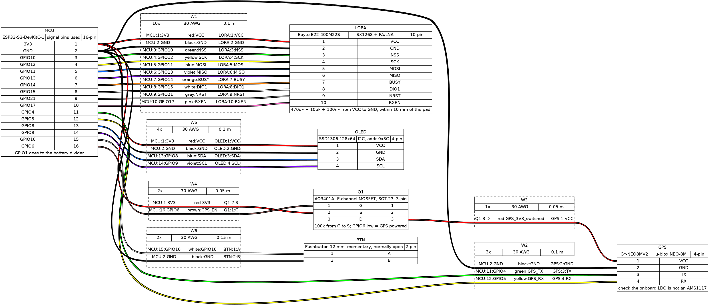

# 433 MHz Meshtastic node

A Meshtastic node built around an ESP32-S3 dev board and an Ebyte E22-400M22S, running on a
2P 18650 pack. Mostly assembled from parts I already had. I wrote this up so I can rebuild it
in a year when I've forgotten how it goes together.

Not a product, not a kit. A dev board, a LoRa module and a GPS on perfboard in a printed box.

## Hardware

| | |
|---|---|
| MCU | ESP32-S3-DevKitC-1 |
| Radio | Ebyte E22-400M22S — SX1268 + PA/LNA, 410–493 MHz |
| GPS | GY-NEO8MV2 (u-blox NEO-8M) |
| Display | SSD1306 128×64, I²C |
| Power | 2× 18650 parallel, TP4056 charger, TPS63020 buck-boost to 3.3 V |
| Region | EU_433 |

## Layout

```
firmware/     variant.h and the platformio env to build it
hardware/     wiring diagrams, netlist, KiCad schematic
docs/         build notes, BOM, troubleshooting
```

## Building the firmware

No stock Meshtastic target fits this hardware, so it needs compiling from source. The E22 has
an external PA whose LNA side needs an RXEN pin driven by the MCU, and nothing prebuilt drives
an arbitrary GPIO for that.

```bash
git clone https://github.com/meshtastic/firmware.git
cd firmware
git submodule update --init --recursive

mkdir -p variants/esp32s3-e22-433
cp /path/to/this/repo/firmware/variant.h variants/esp32s3-e22-433/
cat /path/to/this/repo/firmware/platformio-env.ini >> platformio.ini

pio run -e esp32s3-e22-433 -t upload
pio run -e esp32s3-e22-433 -t monitor
```

Then set the region, or it won't transmit at all:

```bash
meshtastic --set lora.region EU_433
meshtastic --set lora.modem_preset LONG_FAST
```

## Wiring



Signal harness above, power section in [docs/power-schematic.svg](docs/power-schematic.svg).
The harness diagram is generated from `hardware/harness.yml` with
[WireViz](https://github.com/wireviz/WireViz) — edit the YAML, run `wireviz harness.yml`.

Pin labels are signal names, not module pin numbers. Ebyte's numbering varies between
revisions, so check your own datasheet before soldering.

## Things that caught me out

**The E22-400M22S is an SX1268, not an SX1262.** The 900 MHz sibling is the SX1262. Wrong
define, dead radio.

**TXEN is already bonded to DIO2 inside the module.** So `SX126X_DIO2_AS_RF_SWITCH`,
`SX126X_TXEN RADIOLIB_NC`, and leave the TXEN pad alone. Only RXEN needs a GPIO. Driving TXEN
from a pin puts you in contention with DIO2.

**`ADC_CHANNEL` needs the enum, not the IDF macro.** `ADC1_GPIO1_CHANNEL` expands to a plain
`int` in current esp-idf and `Power.cpp` wants an `adc_channel_t`. Use `ADC_CHANNEL_0`.

**A plain buck can't make 3.3 V from one Li-ion cell.** Obvious in hindsight — a step-down
drops out around 3.7 V and you lose most of the discharge curve. Needs a buck-boost.

**The DevKitC is too wide for breadboard-pattern prototyping board.** Its PCB body overhangs
its own pin rows and covers the holes you'd connect to. One accessible row on one side, none on
the other. Plain isolated-pad perfboard sidesteps it, since you wire underneath.

## Status

Works. Runtime is 50–70 h on the 2P pack with the GPS running continuously, which is fine for
what I want but nowhere near what a purpose-built board would do — the DevKitC's USB-UART
bridge and RGB LED are powered permanently and there's no getting around that.

Ideas, in no particular order:

- [ ] Move to a bare ESP32-S3-WROOM-1 for a real low-power version
- [ ] Proper PCB instead of perfboard
- [ ] SHT41 on the spare I²C bus for temperature telemetry
- [ ] Better antenna — the monopole has no counterpoise worth the name

## Licence

MIT, see [LICENSE](LICENSE). The Meshtastic firmware itself is GPL-3.0.
